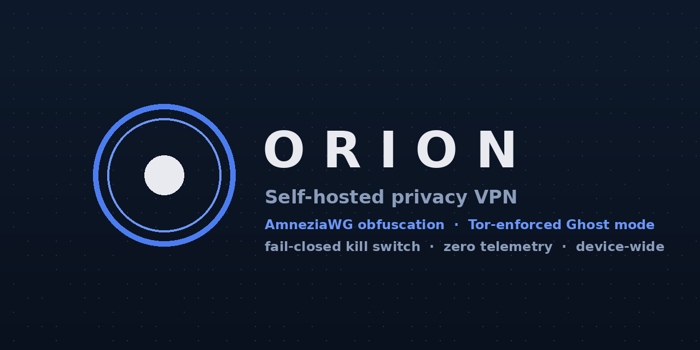
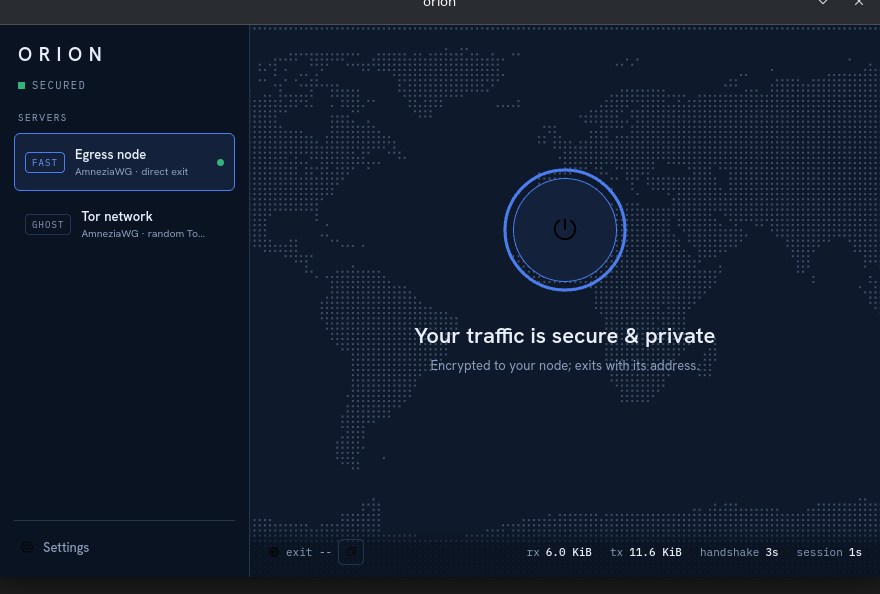
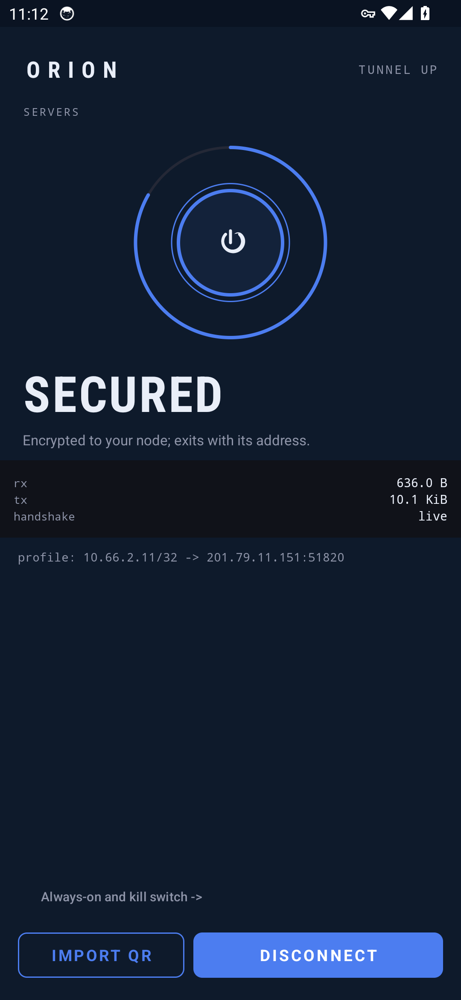

<div align="center">

[](https://github.com/baselanaya/Orion/actions/workflows/ci.yml)
[](LICENSE)


# ORION

**Self-hosted privacy VPN — obfuscated WireGuard with Tor-enforced Ghost mode.**



*No tracking · No accounts · No cloud provider trust chain*

</div>

---

Orion is a self-hosted personal VPN: two of your own VPS nodes running an
**AmneziaWG-obfuscated** tunnel with a **mandatory Tor egress** ("Ghost mode"),
driven by a small cross-platform **Tauri desktop client** with a fail-closed
kill switch.

Built for one person and their own infrastructure: your ISP sees obfuscated
noise, the websites you visit see Tor exits, and nothing in between is left
to a commercial VPN provider.

## Features

| | |
|---|---|
| **No tracking** | Zero telemetry, zero analytics, zero accounts. The client talks only to your own node and (for the exit-city display) a single geolocation lookup. |
| **Strong encryption** | 256-bit authenticated encryption (ChaCha20-Poly1305 — the WireGuard standard) on every hop, wrapped in AmneziaWG junk-packet obfuscation to defeat DPI. |
| **DNS protection** | DNS rides the encrypted tunnel; Ghost mode resolves through Tor's DNS port. Policy is yours: profile default, a custom resolver, or off — enforced through the tunnel, with a self-test that tells the truth about your system. |
| **Auto start** | Optional one-toggle auto-connect: Orion secures your traffic the moment it opens. Plus OS-login autostart for the app itself. |
| **Device-wide VPN** | The tunnel is enforced system-wide by nftables — every app on the machine is covered, with a fail-closed kill switch if any hop dies. Three policies: strict, allow-LAN, off. |
| **Ghost mode** | All egress force-routed through the Tor network (TCP + DNS), enforced server-side per peer — a client bug can't bypass it. |
| **NEW ID** | One click rotates your Tor circuits and hands you a fresh exit identity. |
| **Notifications** | Desktop notifications when your traffic gets confined, when a fault seals the machine, and when circuits rotate. |
| **System tray** | Close to tray; state-colored icon (offline / secured / ghost); per-server connect, disconnect, NEW ID and Tor Browser from the menu — the tunnel never depends on the window. |

## Honest limits (read before trusting it)

This design protects you from your ISP, local networks, casual surveillance
and IP-based blocking. It does **not** make you untraceable against a global
passive adversary, and the payment trail of your own VPS is an accepted
trade-off. See [docs/personal-vpn-system-design.md §10](docs/personal-vpn-system-design.md).

## Architecture

```
Desktop client (Tauri + root helper)
        |
  AmneziaWG, obfuscated (port 4500/UDP)
        |
  Your entry node ── fast: direct NAT exit
        |                double/ghost: second hop, source preserved
  Your egress node ── ghost: Tor TransPort/DNSPort ──▶ Tor network
```

- **Fail-closed kill switch**: nftables rules install *before* the tunnel
  comes up and live in the kernel — if the helper or tunnel dies, the machine
  is sealed (`locked_no_tunnel`), never exposed.
- **Server-side enforcement**: mode policy is per-peer firewall rules on the
  nodes. Ghost peers can reach Tor and nothing else, no matter what the
  client does.

Full system design: [docs/personal-vpn-system-design.md](docs/personal-vpn-system-design.md) ·
review history: [REVIEW.md](REVIEW.md) · phase runbooks: [docs/](docs/)

## Requirements

- **Nodes**: 2× any VPS (512 MB RAM is enough), Debian 12/13, reachable by SSH
- **Controller**: Ansible (via `uv sync` in this repo) + `wireguard-tools`
- **Client**: Linux + [Tauri prerequisites](https://v2.tauri.app/start/prerequisites/) +
  `wireguard-tools` and `amneziawg-dkms`/`amneziawg-tools` (CachyOS ships both;
  Debian uses the Amnezia PPA — provisioned automatically for the nodes)

## Quick start (rent any VPS, add credentials, done)

1. Rent a **Debian 12/13** VPS from any provider ($4–6/mo is plenty) and add
   your SSH key in their panel — or let the onboarding script prompt you for
   a password once.
2. From your machine:

   ```bash
   uv sync                       # one-time tooling (uv: docs.astral.sh/uv)
   scripts/onboard.sh            # asks for the node IP; does everything else
   ```

   The script provisions the node (hardening, obfuscated AmneziaWG, Tor,
   kill-switch firewall), generates a client profile, and finishes with the
   server's public key already wired into `/etc/orion/profiles/`.
3. Launch Orion, press connect.

## Manual server setup

```bash
uv sync                                             # tooling
cp ansible/inventory.example.yml ansible/inventory.yml   # edit: IPs, user
cp ansible/host_vars/egress-1.example.yml ansible/host_vars/egress-1.yml
ansible-playbook -i ansible/inventory.yml ansible/site.yml -K
```

The playbook hardens the node (key-only SSH, fail2ban, volatile logs,
unattended upgrades), deploys the consolidated nftables ruleset (QUIC + IPv6
drops, per-mode pools), AmneziaWG, and the Tor client. It prints the server
public key for your client profile. Full runbook:
[docs/phase-1.md](docs/phase-1.md) and [docs/phase-2.md](docs/phase-2.md).

## Client

```bash
./scripts/install-client.sh        # build + install helper service + app
# or: cd client/app/src-tauri && npx @tauri-apps/cli@2 build   # .deb + AppImage
```

1. Create a client profile (keys generated client-side; the server only ever
   sees public keys) — `scripts/new-peer.sh`, then place the conf at
   `/etc/orion/profiles/<name>.conf`.
2. Launch **Orion** from your app menu. Select a server, press connect.



3. `sudo orion-helper unlock` is the documented emergency exit.

## Repository layout

```
ansible/        node provisioning (hardening, AmneziaWG, Tor, nftables)
client/         Tauri app (UI), root helper daemon, IPC protocol crates
docs/           system design, phase runbooks, design spec, review
scripts/        onboarding, peer keys, node update, uninstall, validation
```

## Mobile (Android / iOS)

The node runs a plain-WireGuard listener (port 51820/UDP) for phones, and there
is now a first-party **Orion Android app** (`client/android/`) — Kotlin +
the official WireGuard Go userspace, same navy UI as the desktop. Live-verified
on an emulator 2026-09-07: QR profile import, persistence, and always-on
kill-switch reconnect across a full reboot.

```bash
scripts/new-mobile-peer.sh <peer-name>     # prints keys + the peer snippet
scripts/node-update.sh                     # applies the new peer to the node
scripts/mobile-qr.sh <profile.conf>        # scannable QR for the phone
cd client/android && gradle assembleDebug  # APK (~20MB, all ABIs)
```

Runbook + emulator e2e: [docs/phase-mobile.md](docs/phase-mobile.md).



iOS has no client yet. Ghost-mode obfuscation on mobile needs an AWG-capable
client (AmneziaWG app) or a future Orion addition; over mobile networks, plain
WireGuard handshakes are typically unfiltered (unlike some home ISPs).

## Upkeep

```bash
scripts/node-update.sh          # re-apply the playbook: package upgrades + config drift
scripts/uninstall-client.sh     # remove the client (profiles kept; --purge removes them)
```

## Roadmap

- [x] Obfuscated single-node VPN (Fast) + Tor Ghost mode
- [x] Fail-closed kill switch + NEW ID (circuit rotation)
- [x] System tray (menu: connect, NEW ID, quit; close-to-tray)
- [x] Tor Browser launcher from Ghost mode (its own Tor rides our tunnel)
- [x] SimpleLogin alias creation (API key in Settings; built through the tunnel)
- [x] Windows/macOS app bundles via CI (tunnel control is Linux-first today)
- [ ] Entry-node chaining (double hop) — role built, awaiting hardware
- [ ] Native Windows/macOS helper (per-OS kill switch: WFP / Network Extension)

## License

[MIT](LICENSE)
